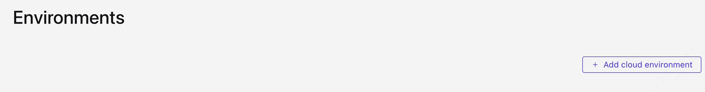
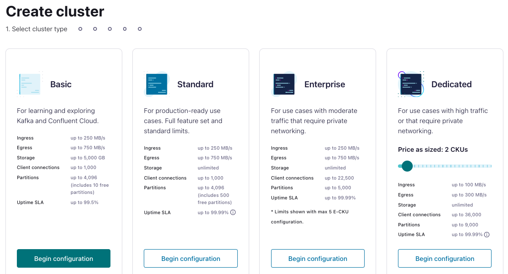
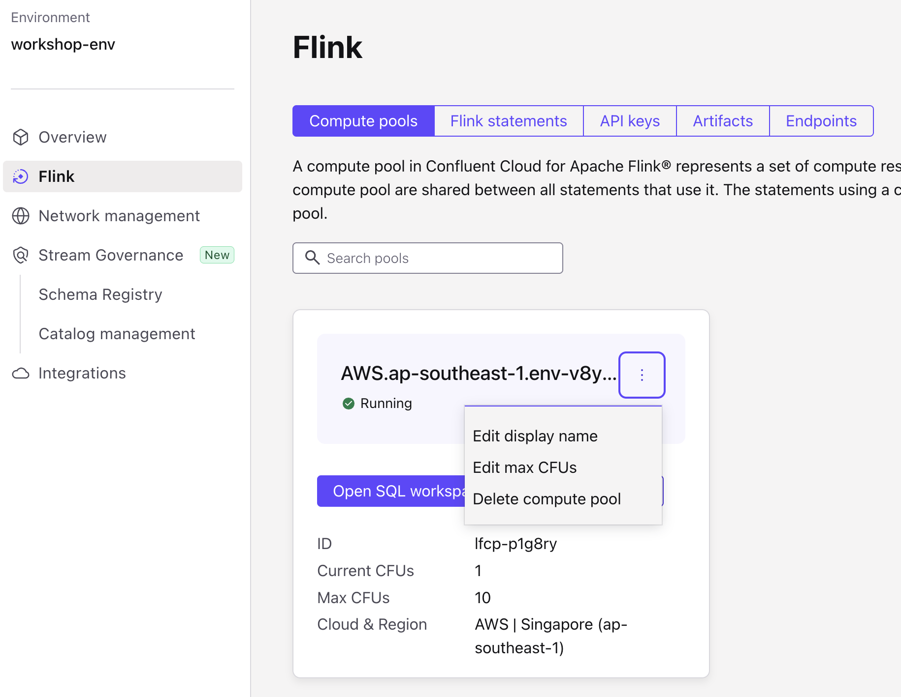

# <div align="center">Introduction Integration on Confluent Cloud</div>
## <div align="center">Lab Guide</div>
<br>

## **Agenda**
1. [Log into Confluent Cloud](#step-1)
2. [Create an Environment and Cluster](#step-2)
3. [Create an API Key Pair](#step-3)
4. [Create Topics and walk through Confluent Cloud Dashboard](#step-4)
5. [Create Kafka Client to Produce and Consume using Schema Registry](#step-5)
6. [Produce event with CDC](#step-6)
7. [Sink Data without services](#step-7)
8. [Clean Up Resources](#step-8)
9. [Confluent Resources and Further Testing](#step-9)

***

## **Prerequisites**
<br>

1. Create a Confluent Cloud Account.
    - Sign up for a Confluent Cloud account [here](https://www.confluent.io/confluent-cloud/tryfree/).
    - Once you have signed up and logged in, click on the menu icon at the upper right hand corner, click on “Billing & payment”, then enter payment details under “Payment details & contacts”. A screenshot of the billing UI is included below.

> _**Note:** You will create resources during this workshop that will incur costs. When you sign up for a Confluent Cloud account, you will get free credits to use in Confluent Cloud. This will cover the cost of resources created during the workshop. More details on the specifics can be found [here](https://www.confluent.io/confluent-cloud/tryfree/)._

<div align="center" padding=25px>
    
</div>

<div align="center" padding=25px>
    
</div>

<div align="center" padding=25px>
    
</div>

**PROMO CODE: POPTOUT0008UZQK**

2. Confluent Cloud cluster with Advanced Stream Governance package
3. For clients, it recommended to use latest version as Confluent Cloud always maintained the latest patch of Kafka version.

***

## **Objective**

<br>
<div align="center" padding=25px>
    
</div>
In this workshop, you will have learned how to to use Kafka Client and Connectors to produce and consume the data on Confluent Cloud by using the Schema Registry to govern the data on streaming manner.

***


## <a name="step-1"></a>Log into Confluent Cloud

1. Log into [Confluent Cloud](https://confluent.cloud) and enter your email and password, If you don't have account you could sign up and use this promo code to access Confluent Cloud **POPTOUT0003YWTW**.

<div align="center" padding=25px>
    
</div>

2. If you are logging in for the first time, you will see a self-guided wizard that walks you through spinning up a cluster. Please minimize this as you will walk through those steps in this workshop. 

***

## <a name="step-2"></a>Create an Environment and Cluster

An environment contains clusters and its deployed components such as Apache Flink, Connectors, ksqlDB, and Schema Registry. You have the ability to create different environments based on your company's requirements. For example, you can use environments to separate Development/Testing, Pre-Production, and Production clusters. 

1. Click **+ Add cloud environment**. Specify an **Environment Name** and choose the **Essential Package** for stream governance, then Click **Create**. 

>Stream Governance have two option **Essential** and **Advanced**, which in Advanced it will give you more rich features over the governance such as Stream Lineage up to 7 days, Data Catalog, Business Metadata, and unlimited Schema to be registered on Confluent Cloud.

>_**Note:** There is a *default* environment ready in your account upon account creation. You can use this *default* environment for the purpose of this workshop if you do not wish to create an additional environment._

<div align="center" padding=25px>
    
</div>

<div align="center" padding=25px>
    
</div>

2. Now that you have an environment, click **Create Cluster**. 

> **Note:** Confluent Cloud clusters are available in 3 types: Basic, Standard, and Dedicated. Basic is intended for development use cases so you will use that for the workshop. Basic clusters only support single zone availability. Standard and Dedicated clusters are intended for production use and support Multi-zone deployments. If you are interested in learning more about the different types of clusters and their associated features and limits, refer to this [documentation](https://docs.confluent.io/current/cloud/clusters/cluster-types.html).

3. Chose the **Basic** cluster type. 

<div align="center" padding=25px>
    
</div>

4. Click **Begin Configuration**. 
5. Choose **AWS/GCP** as your preferred Cloud Provide on **asia-southeast2/ap-southeast-3 (Jakarta)** region, and **Single-AZ** availability zone. 
6. Specify a **Cluster Name**. For the purpose of this lab, any name will work here. 

<div align="center" padding=25px>
    
</div>

7. View the associated *Configuration & Cost*, *Usage Limits*, and *Uptime SLA* information before launching. 
8. Click **Launch Cluster**. 

***

## <a name="step-3"></a>Create an API Key

1. Click **API Keys** on the navigation menu. 
2. Click **Create Key** in order to create your first API Key. If you have an existing API Key select **+ Add Key** to create another API Key.

<div align="center" padding=25px>
    
</div>

3. Select **Global Access** and then click **Next**. 
4. Copy or save your API Key and Secret somewhere. You will need these later on in the lab, you will not be able to view the secret again once you close this dialogue. 
5. After creating and saving the API key, you will see this API key in the Confluent Cloud UI in the **API Keys** section. If you don’t see the API key populate right away, refresh the browser.
6. Go back to the environment page and select Schema Registry (SR) and copy the Schema Registry endpoint
<div align="center" padding=25px>
    
</div>
<div align="center" padding=25px>
    
</div>

7. Click the API Key to **+Add API Key**
8. Then copy and save your **SR API Key** and **SR API Secret**.

***

## <a name="step-4"></a>Creates Topic and Walk Through Cloud Dashboard

1. On the navigation menu, you will see **Cluster Overview**. 

> **Note:** This section shows Cluster Metrics, such as Throughput and Storage. This page also shows the number of Topics, Partitions, Connectors, and ksqlDB Applications.  Below is an example of the metrics dashboard once you have data flowing through Confluent Cloud.

2. Click on **Cluster Settings**. This is where you can find your *Cluster ID, Bootstrap Server, Cloud Details, Cluster Type,* and *Capacity Limits*.
3. On the same navigation menu, select **Topics** and click **Create Topic**. 
4. Enter **User** as the topic name, **3** as the number of partitions, and then click **Create with defaults**. Skip the data contracts as it will be created on the other step. 

<div align="center" padding=25px>
    
</div>

<div align="center" padding=25px>
    
</div>

5. Repeat the previous step and create a second topic name **transactions** and **3** as the number of partitions.
   
> _**Note:** Topics have many configurable parameters. A complete list of those configurations for Confluent Cloud can be found [here](https://docs.confluent.io/cloud/current/using/broker-config.html). If you are interested in viewing the default configurations, you can view them in the Topic Summary on the right side._ 

6. After topic creation, the **Topics UI** allows you to monitor production and consumption throughput metrics and the configuration parameters for your topics. When you begin sending messages to Confluent Cloud, you will be able to view those messages and message schemas.
   
***


## <a name="step-5"></a>Create Kafka Client to Produce and Consume using Schema Registry
<Details>
<summary>Spring Kafka</summary>

1. Back to your directory and ensure you already clone the github, acess through terminal to edit your **application.properties** for each of your spring client for the endpoint and api key and api secret we have created.
for example:
```bash
cd <path git clone>/Java/ProducerUser/main/resources/application.properties
```

2. Go to first directory **ProducerUser** to run the kafka client.
```bash
mvn clean install
```

3. Now check back to the Confluent Cloud Console on the **User** topic.

4. Stop the producer by using **ctrl+c** to continue with next step on Consumer side on **ConsumerUser** directory.

```bash
add the credential
cd <path git clone>/Java/ConsumerUser/main/resources/application.properties

mvn clean install
```

5. If the consumer running well, it will consume all of the message on the topic with exact schematize data.
</Details>

<Details>
<summary>Python</summary>

1. Back to your directory and ensure you already clone the github, acess the **env.txt as .env** for each of your spring client for the endpoint and api key and api secret we have created.
for example:
```bash
cp <path git clone>/Python/env.txt .env
```

2. Install the requirement using pip or pip3:
```bash
pip3 install -r python-requirement.txt
```

3. Go to first directory **ProducerUser** on Python directory to run the kafka client.
```bash
cd <path git clone>/Python/ProducerUser
python3 ProducerUser.py
```

4. Now check back to the Confluent Cloud Console on the **User** topic.

5. Stop the producer by using **ctrl+c** to continue with next step on Consumer side on **ConsumerUser** directory.

```bash
cd <path git clone>/Python/ConsumerUser
python3 ConsumerUser.py
```
6. If the consumer running well, it will consume all of the message on the topic with exact schematize data.
</Details>

***

## <a name="step-6"></a>Produce event with CDC

1. Let's create CDC PostgreSQL Source Connector on Confluent Cloud, go back to the Cluster page Overview and click **Connectors** on the left tab

2. Search and Click **Postgres CDC Source V2 (Debezium) connector**

3. Fill up the config by using the value on this table and click launch
<div align="center">

| section                            |setting                             | value                        |
|------------------------------------|------------------------------------|------------------------------|
| (1) Kafka credentials              | api key                            | [*from step 5* ](#step-5)    |
| (1) Kafka credentials              | api secret                         | [*from step 5* ](#step-5)    |
| (2) Authentication                 | database hostname                  | 34.101.89.18                 |
| (2) Authentication                 | database port                      | 5432                         |
| (2) Authentication                 | database username                  | replica                      |
| (2) Authentication                 | database password                  | [will be distributed]        |
| (2) Authentication                 | database name                      | postgres                     |
| (2) Authentication                 | ssl mode                           | prefer                       |
| (3) Configuration                  | output record value                | AVRO                         |
| (3) Configuration                  | output record key                  | AVRO                         |
| (3) Configuration                  | topic prefix                       | CDC                          |
| (3) Configuration                  | slot name                          | [yourname]_debezium          |
| (3) Configuration                  | publication name                   | [yourname]_dbz_publication   |
| (3) Configuration                  | tables included                    | public.transactions          |
| (3) Configuration                  | value converter decimal format     | NUMERIC                      |
| (3) Configuration                  | after-state only                   | true                         |
| (3) Configuration                  | decimal handling mode              | double                       |
| (3) Configuration                  | time precision mode                | connect                      |
| (3) Configuration                  | transform name                     | Topic_regexrouter            |
| (3) Configuration                  | transform type                     | TopicRegexRouter             |
| (3) Configuration                  | regex                              | ^[^.]+\.[^.]+\.(.*)$         |
| (3) Configuration                  | replacement                        | $1                           |
| (4) Sizing                         | tasks                              | 1                            |
| (5) Review and Launch              | connector name                     | PostgreSQL_CDC_Source        |
</div>

<div align="center" padding=25px>
    
</div>

<div align="center" padding=25px>
    
</div>

<div align="center" padding=25px>
    
</div>

<div align="center" padding=25px>
    
</div>

<div align="center" padding=25px>
    
</div>

<div align="center" padding=25px>
    
</div>

<div align="center" padding=25px>
    
</div>

4. After launch the connector, you will see new topic created and you can see the transaction message that keep updating from the table
**Notes**: if you have DBeaver or any universal database manager, you could access the DB to read the value.

***

## <a name="step-7"></a>Sink Data to Database without services
1. After capturing all the changes from our postgresql, let's try to offload the data into our MSSQL Server that will be used by another application to be consumed.

2. Go back to the Cluster page Overview and click **Connectors** on the left tab

3. Click **+ Add Connectors** and search **Microsoft SQL Server Sink**

4. Fill up the config by using the value on this table and click launch
<div align="center">
    
| section                            |setting                             | value                                    |   
|------------------------------------|------------------------------------|------------------------------------------|
| (1) Topic selection                | topics name                        | transactions                             |
| (2) Kafka credentials              | api key                            | [*from step 5* ](#step-5)                |
| (2) Kafka credentials              | api secret                         | [*from step 5* ](#step-5)                |
| (3) Authentication                 | connection host                    | 34.50.109.152                            |
| (3) Authentication                 | connection port                    | 1433                                     |
| (3) Authentication                 | connection username                | sqlserver                                |
| (3) Authentication                 | connection password                | [will be distributed]                    |
| (3) Authentication                 | database name                      | workshop                                 |
| (3) Authentication                 | ssl mode                           | prefer                                   |
| (4) Configuration                  | input record value                 | AVRO                                     |
| (4) Configuration                  | input record key                   | AVRO                                     |
| (4) Configuration                  | auto create table                  | true                                     |
| (4) Configuration                  | auto add column                    | true                                     |
| (4) Configuration                  | table name format                  | [yourname]_transactions                  |
| (4) Configuration                  | value converter decimal format     | NUMERIC                                  |
| (4) Configuration                  | timestamp precision mode           | microsecond                              |
| (4) Configuration                  | decimal handling mode              | double                                   |
| (4) Configuration                  | timestamp fields                   | transaction_date, created_at, updated_at |
| (5) Sizing                         | tasks                              | 1                                        |
| (6) Review and Launch              | connector name                     | SQLServer_Sink                           |
</div>

<div align="center" padding=25px>
    
</div>

<div align="center" padding=25px>
    
</div>

<div align="center" padding=25px>
    
</div>

<div align="center" padding=25px>
    
</div>

<div align="center" padding=25px>
    
</div>

<div align="center" padding=25px>
    
</div>

5. Now you could access and see the new table on the MSSQL Server

**Notes**: Access the MSSQL Server using SSMS or DBeaver or any universal database manager, you could access the DB to read the value.
***

## <a name="step-8"></a>Clean Up Resources

Deleting the resources you created during this workshop will prevent you from incurring additional charges. 

1. The first item to delete is the Apache Flink Compute Pool. Select the **Delete** button under **Actions** and enter the **Application Name** to confirm the deletion. 

<div align="center">
    
</div>

2. Next, delete the Datagen Source connectors for **shoe_orders**, **shoe_products** and **shoe_customers**. Navigate to the **Connectors** tab and select each connector. In the settings tab, you will see a **trash** icon on the bottom of the page. Click the icon and enter the **Connector Name**.

<div align="center">
    
</div>

3. Finally, under **Cluster Settings**, select the **Delete Cluster** button at the bottom. Enter the **Cluster Name** and select **Confirm**. 

<div align="center">
    
</div>

*** 

## <a name="step-9"></a>Confluent Resources and Further Testing

Here are some links to check out if you are interested in further testing:
- [Confluent Cloud Documentation](https://docs.confluent.io/cloud/current/overview.html)
- [Apache Flink 101](https://developer.confluent.io/courses/apache-flink/intro/)
- [Stream Processing with Confluent Cloud for Apache Flink](https://docs.confluent.io/cloud/current/flink/index.html)
- [Flink SQL Reference](https://docs.confluent.io/cloud/current/flink/reference/overview.html)
- [Flink SQL Functions](https://docs.confluent.io/cloud/current/flink/reference/functions/overview.html)

***
